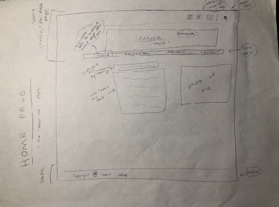

# My INF 7420 Project
I am building an e-Portfolio site to showcase my work throughout my graduate program, and to clearly display my completion of the program and portfolio requirements.

---

## __Wireframes__
The following images are drafts of three pages I plan to include on my website. Below each wireframe, a description of the content will follow.

### Wireframe 1: Landing Page

*Main content* - brief "About Me" section with a photo of myself next to the blurb

*Navigation bar* - will include links to the other pages of my website, like the artifacts and contact pages. Current "active" page in the nav bar will have different colored text to indicate active or inactive

*Header* - static parts of the page that will include the navigation bar, social media links, and banner with my name & degree

*Footer* - will display copyright information

---

### Wireframe 2: Artifacts Page

*Main content* - will have page title to indicate what the content will be, will also have all artifacts displayed 3x2 in "tile" form. Each artifact grouping will be held in container that includes course title, artifact description for program objective, and link to artifact at bottom

*Navigation bar* - will include links to the other pages of my website, like the artifacts and contact pages. Current "active" page in the nav bar will have different colored text to indicate active or inactive

*Header* - static parts of the page that will include the navigation bar, social media links, and banner with my name & degree

*Footer* - will display copyright information

---

### Wireframe 3: Contact Page

*Main content* - will include various ways to contact me (email, linkedin, etc) as well as a contact form for users to fill out

*Navigation bar* - will include links to the other pages of my website, like the artifacts and contact pages. Current "active" page in the nav bar will have different colored text to indicate active or inactive

*Header* - static parts of the page that will include the navigation bar, social media links, and banner with my name & degree

*Footer* - will display copyright information
